# Room Reservation System

## Overview
The Room Reservation System is a web-based application designed to streamline hotel room bookings. It provides an intuitive interface for users to browse hotels, book rooms, and manage reservations, while administrators can oversee hotel details, user accounts, and booking requests.

## Features
- User authentication (Sign-up/Login)
- Hotel and room management
- Booking management (Pending, Approved, Completed bookings)
- User role management (Admin, Cashier, User)
- Dashboard for admin to manage the system
- Payment processing for bookings
- Booking history and details

## Screenshots
### Admin Panel
#### Dashboard
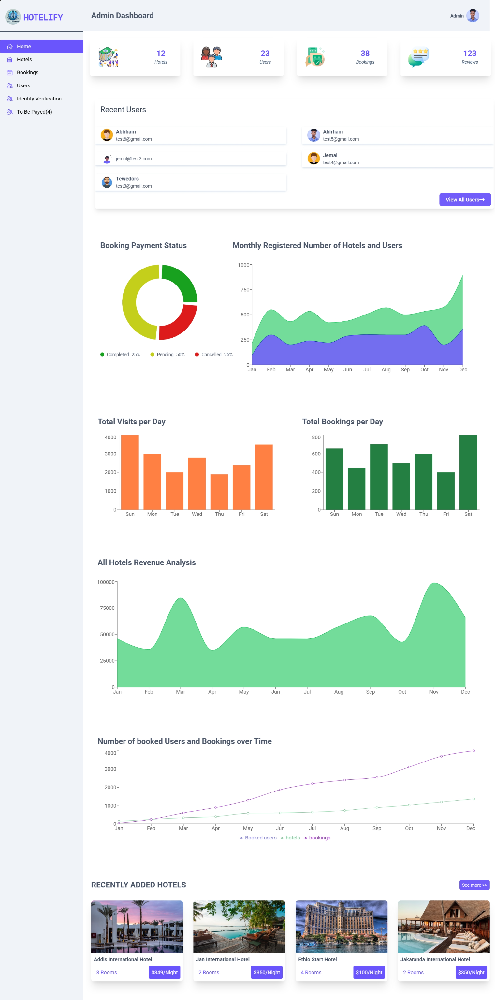

#### Manage Hotels
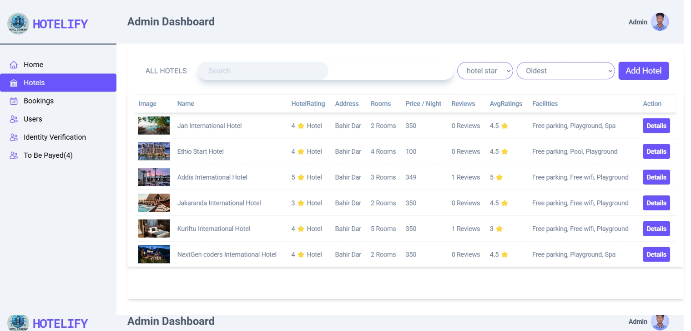

#### View All Bookings
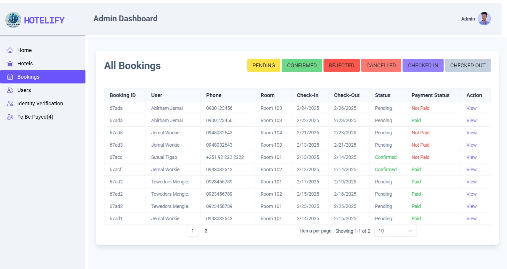

#### Manage Users
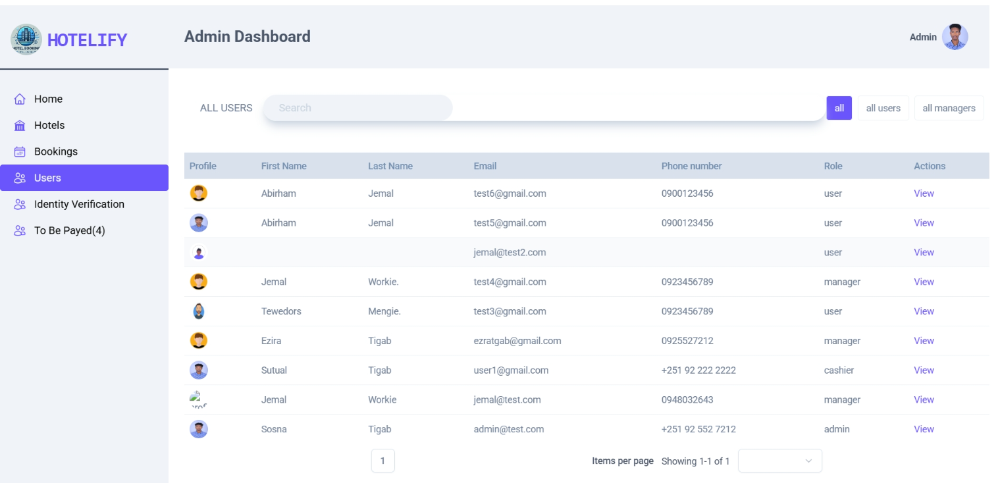

#### Booking Details
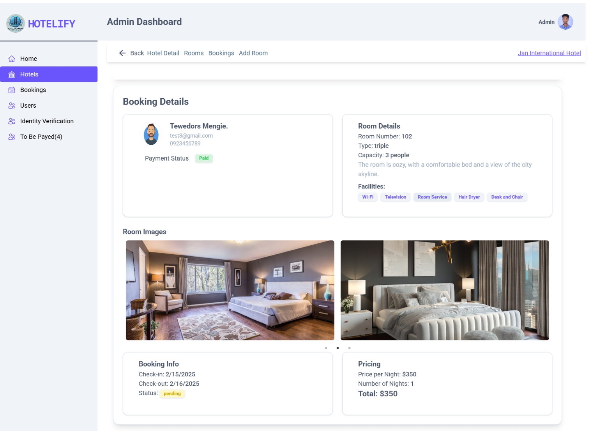

#### Cashier Page

#### Completed Bookings
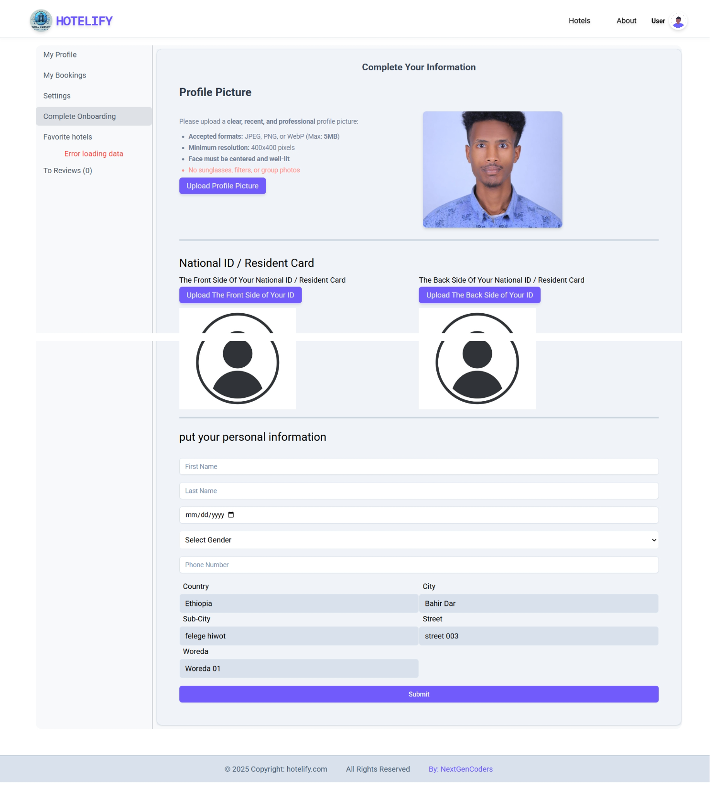

#### Hotel Bookings
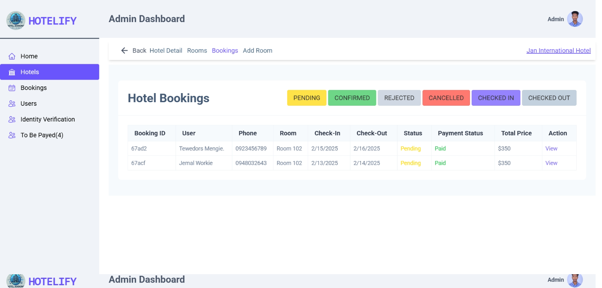

#### Hotel Details
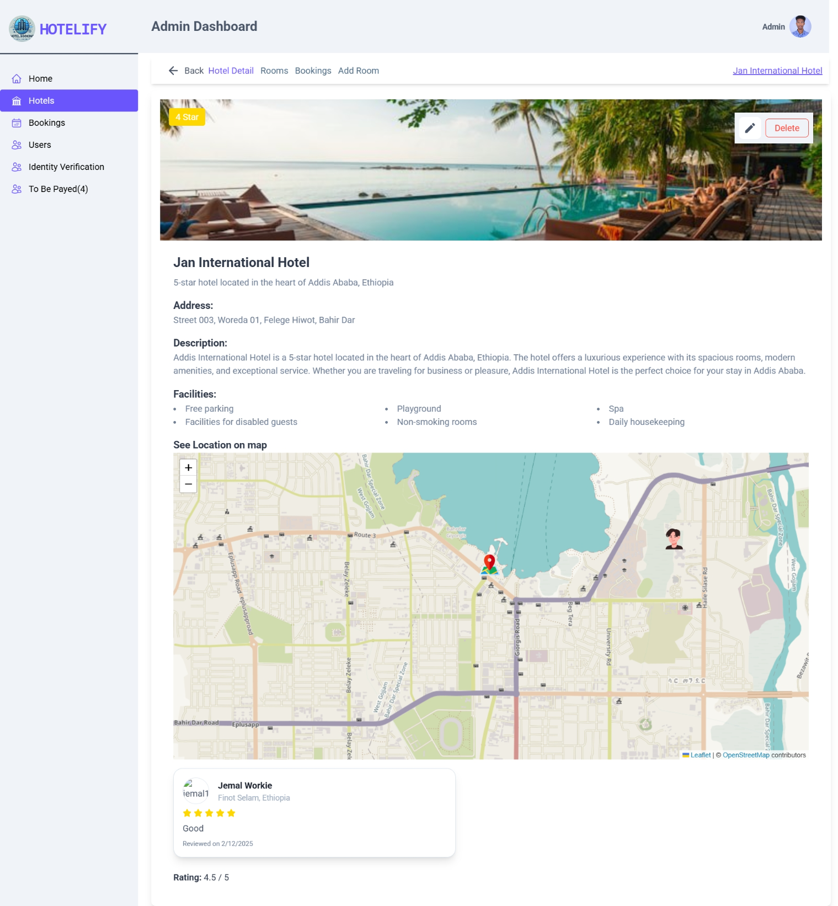

#### Hotel Rooms
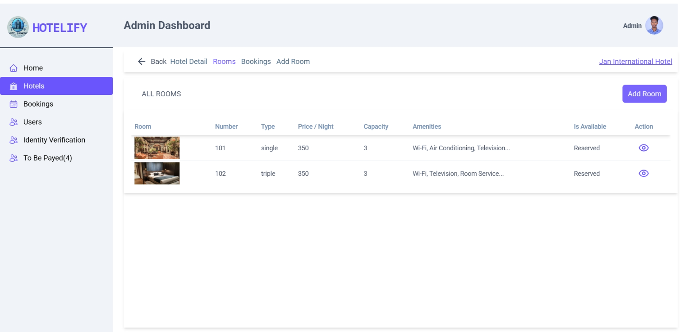

### User Interface
#### Landing Page
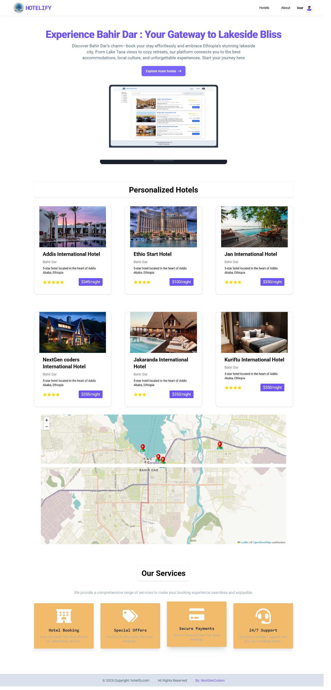

#### Login

#### Pending Bookings
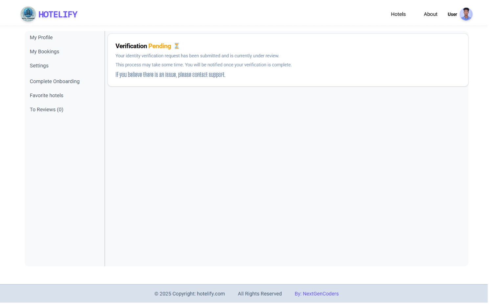

#### Booking Requests
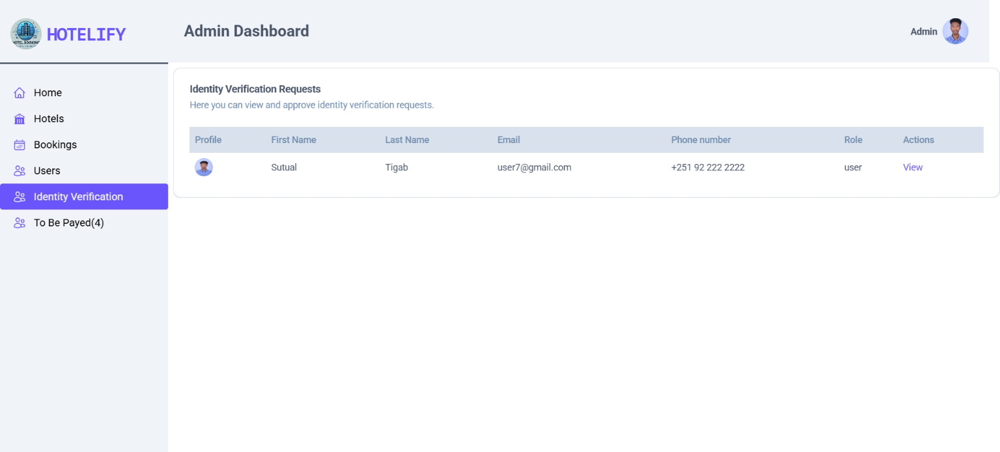

#### Room Details
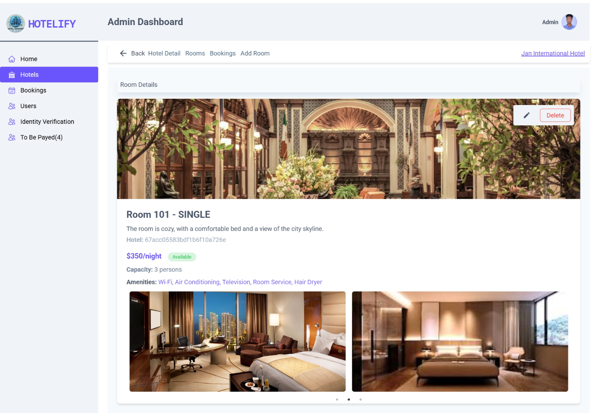

#### Sign Up
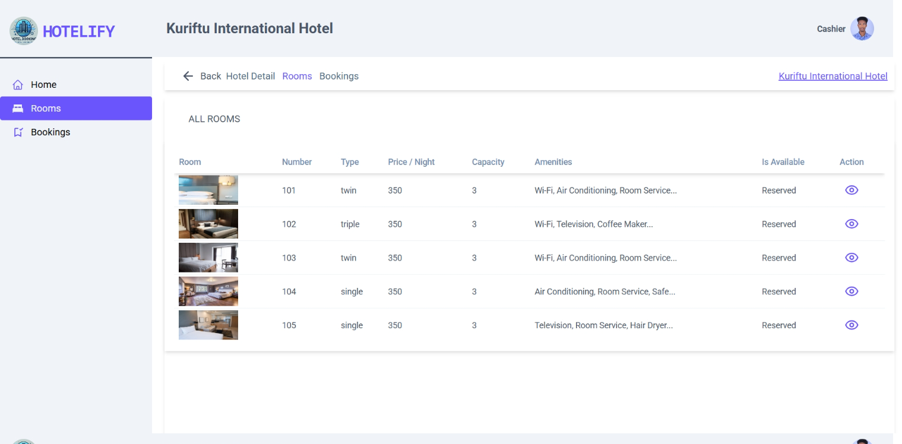

#### Unverified Users
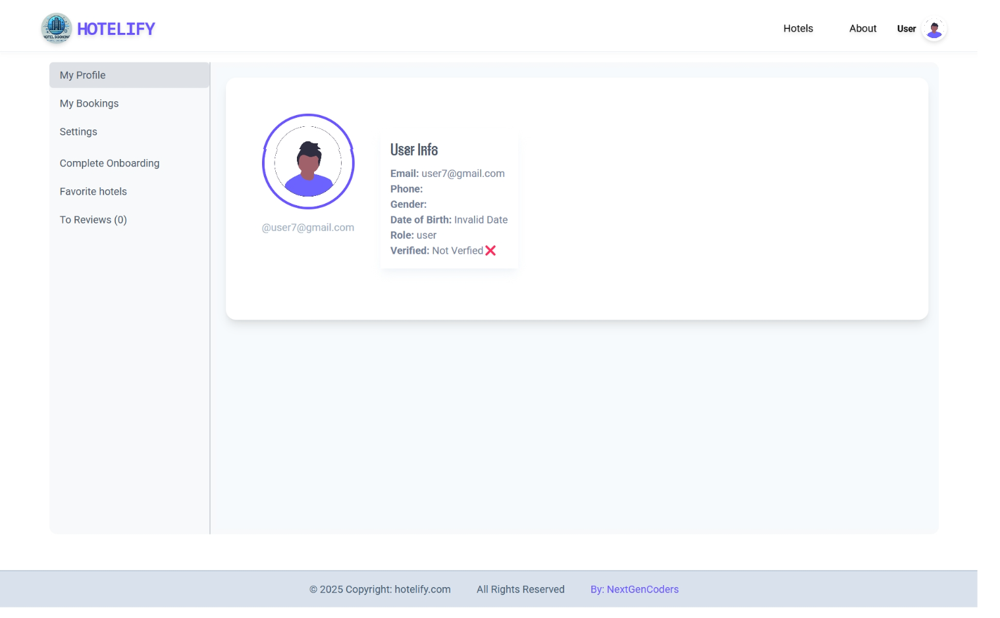

#### User Details
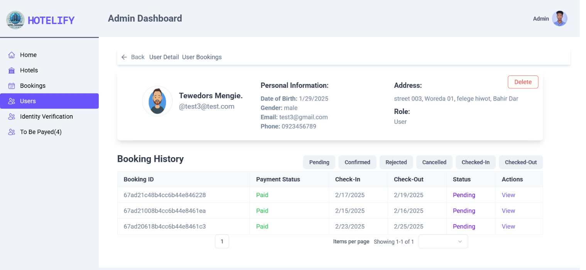

## Technologies Used
- **Frontend:** React.js, Tailwind CSS
- **Backend:** Django Rest Framework
- **State Management:** Redux Toolkit (RTK)
- **Authentication:** OAuth
- **Database:** PostgreSQL
- **API Integration:** Google Maps API

## Contributing
Contributions are welcome! Feel free to submit a pull request or report issues.

## License
This project is licensed under the MIT License.

